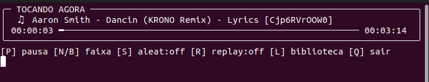
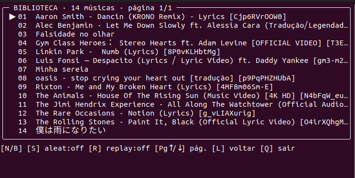

# Music Player

[](https://github.com/jocelinoFG017/music-player/actions/workflows/ci.yml)

Um player de músicas simples para o terminal, com uma ferramenta adicional para
baixar áudios do YouTube.

## ▶️ Rodar o player

1. Coloque suas músicas na pasta `music`.
2. No Ubuntu em que o atalho do projeto já foi configurado, execute:

```bash
rodar player
```

Em outro computador Linux, entre na pasta do projeto e use:

```bash
python3 player.py
```

Formatos aceitos: MP3, WAV, OGG, FLAC e M4A.

### Imagens





### Controles

| Tecla | Ação |
|---|---|
| `P` | Pausar ou continuar |
| `N` | Próxima música |
| `B` | Música anterior |
| `S` | Ativar ou desativar o modo aleatório |
| `R` | Repetir a música atual |
| `L` | Mostrar ou fechar a lista de músicas |
| `PgUp` / `PgDn` | Navegar pela lista |
| `Q` | Sair |

## ⬇️ Baixar uma música

```bash
python3 downloader.py "LINK_DO_YOUTUBE"
```

O arquivo MP3 será salvo em `download-direto`. Para ouvi-lo no player, mova-o
para a pasta `music`.

Use o downloader apenas para conteúdos que você tem autorização para baixar.

## 🔄 Atualizar o downloader

Se o download parar de funcionar por causa de uma mudança no YouTube, execute:

```bash
python3 atualizar_ytdlp.py
```

## Primeira instalação

Veja o guia curto para [instalar e rodar no Ubuntu ou Windows](instrucoes_rodar_player.md).

## Testes

```bash
python3 -m unittest discover -s tests -v
```
